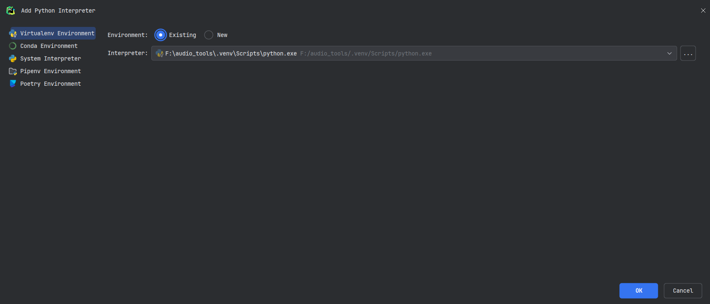
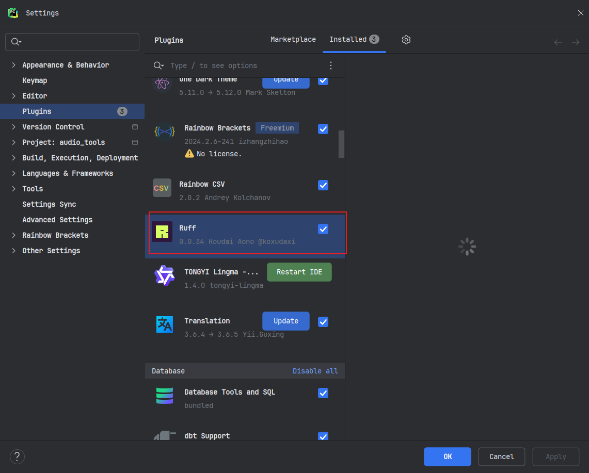
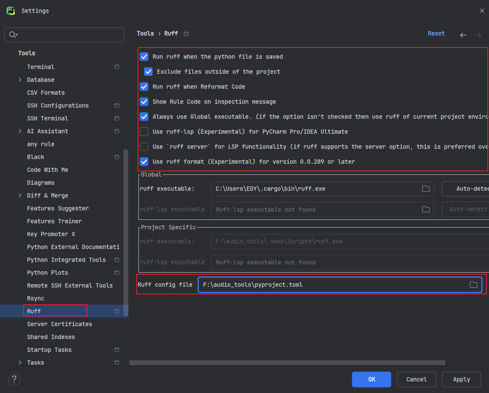
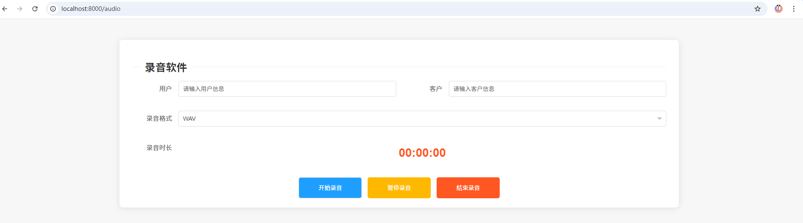

<div align="center" height="256" width="256">
    <h1 style="font-size:36pt; font-weight:600; color:#ff79c6;">AudioTools</h1>
<br>


</div>
<p><b>🔥录音工具</b>


# 录音工具

## 📖目录
- [项目简介](#项目简介)
- [快速启动](#快速启动)
- [动图展示](#动图展示)
- [相关文档](#相关文档)

## ⭐项目简介
录音工具


## ⚡快速启动
>本项目使用 `Python` 、 `PyAudio`、 `uv`、 `ruff`，确保你已经安装了 `Python 3.12+` 、 `PyAudio`、 `uv`、 `ruff`

<br>

1. 克隆仓库到本地
   ```bash
   git clone https://github.com/Uluoyu/audio_tools.git
   ```
<br>

2. 安装依赖环境（参考官方文档安装uv和ruff,最好全局安装）
   ```bash
   uv sync
   ```
<br>

3. 配置uv环境和ruff








4. 运行应用
   ```bash
   python main.py
   ```
   

## ✨动图展示

<details>
<summary><b>展开</b></summary>


### 运行界面



</details>


## 📖 相关文档
1. uv文档
```bash
   https://docs.astral.sh/uv/guides/projects/
   ```

2. ruff文档
```bash
   https://docs.astral.sh/ruff/rules/
   ```

